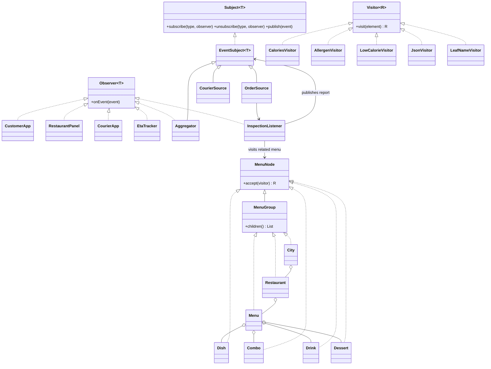

# Food Delivery Class Diagram

```mermaid
classDiagram
    class Subject~T~ { +subscribe(type, observer) +unsubscribe(type, observer) +publish(event) }
    class Observer~T~ { +onEvent(event) }
    class EventSubject~T~
    Subject <|.. EventSubject
    EventSubject <|-- OrderSource
    EventSubject <|-- CourierSource
    Observer <|.. CustomerApp
    Observer <|.. RestaurantPanel
    Observer <|.. CourierApp
    Observer <|.. EtaTracker
    Observer <|.. Aggregator
    Observer <|.. InspectionListener
    EventSubject <|-- Aggregator
    OrderSource --> InspectionListener
    InspectionListener --> MenuNode : visits related menu
    InspectionListener --> EventSubject : publishes report
    class MenuNode { +accept(visitor) R }
    class MenuGroup { +children() List }
    MenuNode <|-- MenuGroup
    MenuGroup <|.. City
    MenuGroup <|.. Restaurant
    MenuGroup <|.. Menu
    City o-- Restaurant
    Restaurant o-- Menu
    Menu o-- Dish
    Menu o-- Combo
    Menu o-- Drink
    Menu o-- Dessert
    MenuNode <|.. Dish
    MenuNode <|.. Combo
    MenuNode <|.. Drink
    MenuNode <|.. Dessert
    class Visitor~R~ { +visit(element) R }
    Visitor <|.. CaloriesVisitor
    Visitor <|.. AllergenVisitor
    Visitor <|.. LowCalorieVisitor
    Visitor <|.. JsonVisitor
    Visitor <|.. LeafNameVisitor
```
